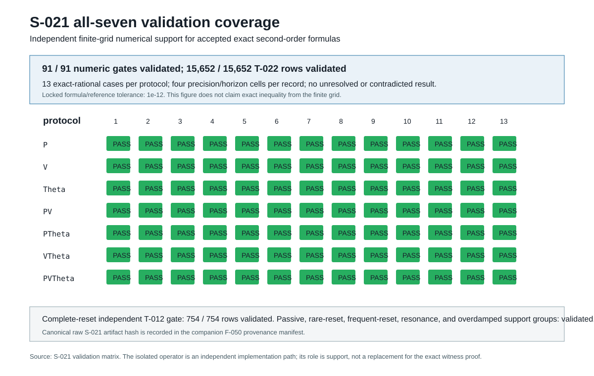

# Exact classification of moments through second order for deterministic reset maps of an inertial active particle

## Abstract

We classify Poisson resetting of a two-dimensional finite-inertia active Brownian particle when any nonempty subset of position, velocity, and orientation is reset to a fixed zero target. At matched \(M>0\), \(\rho>0\), \(\mathrm{Pe}\ge0\), initialization, reset targets, and symmetry conventions, exact component-level second-order laws distinguish the seven maps and all 21 distinct pairs on a predeclared record of means, matrices, centered spatial quantities, and growth classes. Position reset is necessary and sufficient within this family for finite long-time centered spatial variance; without position reset, centered spatial covariance is diffusive. For \(PV/V\), \(P\Theta/\Theta\), and \(PV\Theta/V\Theta\), position reset preserves the complete internal \((v,u)\) stochastic process while changing the spatial sector from transport to localization. Thus sector identity coexists with full-record distinguishability. An independently hand-coded finite-grid moment calculation validates the analytic formula registry at every prespecified test point, but does not establish continuum-wide inequalities. A focused, non-systematic literature assessment supports a provisional novelty boundary around the finite-inertia all-map classification and its scope-labeled restricted-identity ledger.

## Introduction

Stochastic resetting offers a controlled way to alter the trajectory of active matter, but resetting different state variables is not a minor implementation choice. Position, velocity, and orientation enter an inertial active-particle model through distinct state channels. A comparison based only on a scalar displacement statistic can consequently miss a change in mean motion, anisotropy, covariance, or a different sector of the state.

Complete resetting of position, velocity, and orientation has been analyzed for an inertial active Brownian particle, including steady moments through fourth order [1]. Overdamped work has treated position-only, orientation-only, and position-orientation resetting, including the contrast between stationarity under position reset and nonstationary transport without it [2]. Related studies address anisotropic overdamped motion [3], chiral position-orientation resetting with higher moments [4], and resetting of velocity components or orientation in a sorting setting [5]. Direct single-map baselines are also available: orientational resetting of an active Brownian particle produces directed motion with long-time effective diffusion [12]; velocity resetting of inertial transport produces late-time diffusive spatial growth [13]; and position-only [14] or full [15] resetting of passive underdamped motion produces localized stationary distributions. These contributions motivate a narrower question: in one finite-inertia active model, what follows when all nonempty deterministic subsets of the three state variables are classified on one fixed, component-level record?

We answer that question without treating a restricted equality as a protocol equivalence. The result is an exact second-order classification: every distinct map has a separating witness in the complete predeclared record, while some maps retain exact identities after a specified projection, sector restriction, parameter condition, resonance, or singular limit. The distinction is central because raw mean-squared displacement, a matrix trace, or an internal-sector record does not exhaust the full specified state description.

## Model and deterministic reset maps

Between reset events, the dimensionless two-dimensional model is

\[
d r=v\,dt,\qquad
M\,dv=-\bigl(v-\mathrm{Pe}\,u(\theta)\bigr)dt+\sqrt{2}\,dW_t,
\qquad d\theta=\sqrt{2}\,dW_r,
\]

where \(u(\theta)=(\cos\theta,\sin\theta)\), \(W_t\) is a two-component Wiener process, and \(W_r\) is an independent scalar Wiener process. The parameters are inertia \(M>0\), activity \(\mathrm{Pe}\ge0\), and reset rate \(\rho>0\). Reset events form an independent Poisson process. The initial state is \(r(0)=v(0)=0\), \(\theta(0)=0\); an event maps each selected component to zero and retains every unselected component [6].

| Map | Position \(r\) | Velocity \(v\) | Orientation \(\theta\) |
|---|---|---|---|
| \(P\) | reset | retain | retain |
| \(V\) | retain | reset | retain |
| \(\Theta\) | retain | retain | reset |
| \(PV\) | reset | reset | retain |
| \(P\Theta\) | reset | retain | reset |
| \(V\Theta\) | retain | reset | reset |
| \(PV\Theta\) | reset | reset | reset |

For protocol \(q\), the predeclared record \(\mathcal R_2(q;M,\mathrm{Pe},\rho)\) has a fixed temporal meaning. It contains the component means of \(r,v,u\); all components of \(R=E[rr^T]\), \(S=E[vv^T]\), \(C=E[rv^T]\), \(Q=E[ru^T]\), \(W=E[vu^T]\), and \(U=E[uu^T]\); scalar contractions; centered spatial covariance; and the spatial growth class [6]. For a position-reset map, these entries are their stationary long-time limits, including the finite centered spatial variance. For a map without position reset, the internal \((v,u)\) entries are stationary limits and the spatial entries are the coefficients of the accepted long-time polynomial record: \(\bar r(t)=\bar v\,t+b+o(1)\), \(\operatorname{Cov}r(t)=2\mathsf D\,t+O(1)\), the corresponding raw \(R,C,Q\) coefficients, \(D_{\rm eff}=\operatorname{Tr}\mathsf D/2\), and the centered and raw growth classes. Equality of records means equality of every applicable stationary value and every applicable long-time coefficient at matched parameters; it is not a claim of finite-sample recoverability or equality of unspecified finite-time transients. Mean drift, centered growth, and raw mean-squared displacement are separate quantities.

## Analytic moment approach

The classification uses the generator of the continuous dynamics plus the jump pullback for each deterministic reset map. For a selected observable in the closure, the reset contribution is \(\rho\,[f(R_qX)-f(X)]\), where \(R_q\) is the map in the table. Closure of the specified first and second moments yields a finite linear Itô-plus-jump system. Exact stationary solutions, where defined, and exact long-time growth laws provide the protocol records. The reset term makes the source of each distinction explicit: position resetting enters spatial rows, whereas it does not enter the internal \((v,u)\) rows. The complete ordered basis, hierarchy, pairwise witness table, identity formulas, and limits are given in the [technical supplement](PHASEMAP_TECHNICAL_SUPPLEMENT.md).

Pairwise classification is carried out only at matched parameters and conventions. An equality of a trace or other contraction is retained in a separate ledger, rather than substituted for equality of all required components. The analytic result is therefore a statement about a specified record, not about finite-sample recovery of reset maps and not about cross-parameter mimicry [6–8].

## Exact classification

### Theorem

Let \(\mathcal P=\{P,V,\Theta,PV,P\Theta,V\Theta,PV\Theta\}\). For every \(M>0\), \(\rho>0\), and \(\mathrm{Pe}\ge0\), with reset targets, initialization, nondimensionalization, and symmetry conventions matched, each distinct \(X,Y\in\mathcal P\) has a nonidentical complete component-level second-order record:

\[
\mathcal R_2(X;M,\mathrm{Pe},\rho)\ne
\mathcal R_2(Y;M,\mathrm{Pe},\rho).
\]

Moreover, for the three pairs differing only by position reset,

\[
PV\equiv V,\qquad P\Theta\equiv\Theta,\qquad PV\Theta\equiv V\Theta
\quad\text{on the complete internal }(v,u)\text{ process},
\]

while their spatial records differ. These are sector identities, not protocol equivalences [7].

### Exhaustive 21-pair witness partition

The proof partitions the 21 unordered pairs without overlap. First, 12 pairs differ in their position-reset indicator. The position-reset map has finite long-time centered spatial variance and bounded raw mean-squared displacement, while its non-position counterpart has linearly growing centered covariance. Spatial growth class is therefore a witness, including at \(\mathrm{Pe}=0\). Second, among pairs with the same position-reset indicator but different orientation-reset status, the required orientation mean \(\bar u\) or orientation matrix \(U\) separates the records at positive reset rate. Third, three pairs have the same position- and orientation-reset indicators but different velocity-reset status. For \(P/PV\), both velocity means vanish, but the exact diagonal velocity-matrix difference is

\[
S_{P,ii}-S_{PV,ii}=
\frac{\rho\left[
M^2\mathrm{Pe}^2\rho+M^2\mathrm{Pe}^2+2M^2\rho+2M^2+
3M\mathrm{Pe}^2+2M\rho+4M+2\right]}
{2(M+1)(M\rho+2)(M\rho+M+1)}>0 .
\]

For \(P\Theta/PV\Theta\) and \(\Theta/V\Theta\), the velocity means differ whenever \(\mathrm{Pe}>0\); at \(\mathrm{Pe}=0\), each diagonal velocity component differs by \(\rho/(2+M\rho)>0\). These witnesses cover the complete activity domain. Each pair enters exactly one case, so special trace coincidences, passive scalar identities, and resonance surfaces do not overturn the theorem [7,8].

### Long-time spatial classification

| Map | Position reset | Centered spatial class at \(\rho>0\) | Raw-MSD class | Exact scope |
|---|---:|---|---|---|
| \(P\) | yes | stationary/localized | bounded | all \(M>0,\mathrm{Pe}\ge0\) |
| \(PV\) | yes | stationary/localized | bounded | all \(M>0,\mathrm{Pe}\ge0\) |
| \(P\Theta\) | yes | stationary/localized | bounded | all \(M>0,\mathrm{Pe}\ge0\) |
| \(PV\Theta\) | yes | stationary/localized | bounded | all \(M>0,\mathrm{Pe}\ge0\) |
| \(V\) | no | diffusive | diffusive | \(\bar v=0\) identically |
| \(\Theta\) | no | diffusive | ballistic iff \(\mathrm{Pe}\rho>0\); otherwise diffusive | \(\bar v=\mathrm{Pe}\rho e_x/(1+\rho)\) |
| \(V\Theta\) | no | diffusive | ballistic iff \(\mathrm{Pe}\rho>0\); otherwise diffusive | \(\bar v=\mathrm{Pe}\rho e_x/[(1+\rho)(1+M\rho)]\) |

Thus, within this family and at positive reset rate, position reset is necessary and sufficient for finite long-time centered spatial variance. Orientation reset can create a nonzero mean drift and raw ballistic growth without changing the centered diffusive classification. At \(\rho=0\), no reset acts and all maps reduce to the free process; that endpoint is outside the theorem's positive-rate domain [7,8].

## Restricted-identity ledger

The exact equalities below are intentionally scope-labeled. They demonstrate information loss under contraction or restriction, not failure of full-record distinguishability.

| Label | Pair or scope | Exact equality | Separating witness or boundary |
|---|---|---|---|
| Sector identity | \(PV/V\), \(P\Theta/\Theta\), \(PV\Theta/V\Theta\) | complete internal \((v,u)\) process | localized spatial sector versus centered diffusion |
| Contracted-observable degeneracy | \(PV/PV\Theta\) | \(\operatorname{Tr}S\), \(\operatorname{Tr}C\), \(\operatorname{Tr}R\) | orientation means, anisotropic components, centered spatial covariance |
| Contracted-observable degeneracy | \(V/V\Theta\) | \(\operatorname{Tr}S\) | \(\bar u\), mean drift, and diffusion distinction in the active interior |
| Resonant identity | \(P/P\Theta\), \(M\rho=1\) | \(\mathrm{TrS}:=\operatorname{Tr}S\), \(\mathrm{TrC}:=\operatorname{Tr}C\), and \(\mathrm{TrR}:=\operatorname{Tr}R\) | orientation and spatial components remain distinct |
| Conditional identity | passive \(\mathrm{Pe}=0\) translational sectors | \(P/P\Theta\), \(PV/PV\Theta\), \(V/V\Theta\) translational equality | orientation outputs remain distinct |
| Limiting identity | derive the exact finite-\(M\) stationary position moments or long-time drift/diffusion coefficients, then take \(M\to0^+\) at fixed \((\rho,\mathrm{Pe})\), comparing position outputs only | \(P/PV\), \(P\Theta/PV\Theta\), \(\Theta/V\Theta\) | velocity is no longer an independent state; no path-space or velocity-record convergence, reverse order, or joint reset-rate limit is asserted |
| Limiting identity | \(\rho=0\) | all maps reduce to free motion | no positive-rate reset acts |

For the generic \(PV/PV\Theta\) contraction degeneracy, the equalities are

\[
E|v|^2=\operatorname{Tr}S,\qquad
E[r\mathbin{\cdot}v]=\operatorname{Tr}C,\qquad
E|r|^2=\operatorname{Tr}R
\]

for both maps throughout the finite physical domain. In the active interior, their centered spatial covariance traces nevertheless separate exactly:

\[
\operatorname{Tr}\operatorname{Cov}_{PV}(r)-
\operatorname{Tr}\operatorname{Cov}_{PV\Theta}(r)=
\frac{\mathrm{Pe}^2}{(1+\rho)^2(1+M\rho)^2}>0.
\]

At \(\mathrm{Pe}=0\), the orientation mean remains a witness. Likewise, \(V\) and \(V\Theta\) have equal \(\operatorname{Tr}S\) but remain distinct on orientation and spatial outputs. For \(P/P\Theta\), the named triple \((\mathrm{TrS},\mathrm{TrC},\mathrm{TrR})\) is resonantly equal at \(M\rho=1\), because the differences contain \(\mathrm{Pe}^2(M\rho-1)\); it is still not a full-record equality [7,8].

The identities are also bounded by their stated scopes. On the analytic-only curve
\[
\rho=\frac12,\qquad
\mathrm{Pe}^2=
\frac{27M(M+6)(3M+2)}
{2(44-9M-80M^2-12M^3)},\qquad
0<M<M_\star ,
\]
where \(M_\star\) is the unique positive root of
\(44-9M-80M^2-12M^3=0\)
(\(M_\star=0.658170892\ldots\)). On this domain, \(V\) and \(\Theta\) have the same diffusion tensor. Their records remain distinct: \(\Theta\) has nonzero mean drift and ballistic raw MSD, whereas \(V\) has zero drift and diffusive raw MSD. S-021 did not sample this tuned curve, so the equality is retained as an exact analytic identity, not as a numerically witnessed result. Coincident rare- or frequent-reset leading coefficients are identities only of the named coefficients. The \(M\to0^+\) ledger entry is an output-level Smoluchowski--Kramers comparison: hold \(\rho\), \(\mathrm{Pe}\), and the reset targets fixed; obtain the exact stationary position moments or long-time drift/diffusion coefficients at each finite \(M>0\); then take \(M\to0^+\) and compare only those position outputs with the reduced equation \(dr=\mathrm{Pe}\,u\,dt+\sqrt2\,dW\). It does not assert convergence of the velocity record, a transient path-space topology, the reverse order, or a joint reset-rate limit. No internal higher-order observable can distinguish members of any of the three position-toggle sector-identity pairs because their complete internal processes coincide; any optional contrast would have to involve the spatial sector [7].

## Independent validation

The exact classification is analytic. Independent numerical support used a fixed, independently hand-coded 28-coordinate Itô-plus-jump moment operator that constructed between-reset rows and reset pullbacks directly from the stated model and maps, rather than importing PHASEMAP theory or simulation modules. Only after isolated numerical outputs and matrix hashes were computed did a separate adapter evaluate the analytic formula set at high precision [9].

| Validation element | Fixed coverage | Result and interpretation |
|---|---|---|
| Maps and cases | 7 maps; 13 exact-rational cases | active, passive, resonance, above-resonance, and finite-inertia overdamped-support cases |
| Numerical checks | 91 | all validated |
| Formula rows | 15,652 | all validated at prespecified criteria |
| Complete-reset layer | 754 \(PV\Theta\) component/scalar rows | all validated against the independent baseline layer |
| Mandatory limit groups | complete reset, passive, rare, frequent, resonance, overdamped trend | all validated |

The grid contains four fixed precision/horizon cells per protocol-case record and stationary or transport probes appropriate to the map class. This calculation provides independent finite-grid support for the formula registry and its prescribed limits. It does not prove continuum-wide equality or inequality, establish event sequencing, or establish a higher-order or distributional result [9].

Two fixed all-seven trajectory-validation attempts, S-071 and its fresh replacement S-073, were unresolved for their planned quantitative comparisons: S-071 validated 14 of 46 required items and left 32 unresolved; S-073 validated 32 of 46 and left 14 unresolved; neither contradicted an item. They are therefore not quantitative validation of the trajectory claim. The retained trajectory evidence is qualitative: prespecified signs or equalities, Richardson residual convergence, internal-sector identities, and reference-scope checks validated. These results support those limited features only and do not upgrade unresolved interval-containment or precision-adequacy comparisons to agreement.

## Novelty and relation to prior work

The relevant boundary is deliberately narrow. Patel and Shee study the same broad inertial-active setting with complete position-velocity-orientation resetting and derive steady moments through fourth order [1]. Shankari and Sahoo analyze an underdamped active Ornstein-Uhlenbeck particle under resetting [16], while Howlader, Mondal, and Das study velocity resetting of an inertial run-and-tumble particle [17]. These works rule out a broad claim based on complete reset, fourth moments, or “inertial active resetting” alone.

Kumar, Sadekar, and Basu analyze an overdamped two-dimensional active Brownian particle with position-and-orientation, position-only, and orientation-only reset choices [2]. Ghosh, Mandal, and Chaki study the corresponding three choices for an anisotropic overdamped particle [3], and Baouche *et al.* derive directed motion and long-time centered diffusion under orientational resetting [12]. Position-orientation resetting has also been treated in a harmonic trap with exact second and fourth moments [18], for first-passage optimization [25], and in a chiral model with excess-kurtosis diagrams [4]. Cleuren and Eichhorn use velocity-component or orientation resetting for sorting [5], and recent accepted work uses position reset to optimize active-particle area exploration [22]. State-coordinate reset subsets in active-particle models, anisotropic moments, non-Gaussianity, and individual \(P\) or \(\Theta\) behaviors are therefore not distinctive claims here.

Passive phase-space work further narrows the structural language. Singh compares joint position-velocity reset with position-only reset retaining velocity [19], and Capała and Dybiec compare position-only, velocity-only, and joint reset [20]. Chaki, Stølevik Olsen, and Löwen give a passive position/orientation three-protocol taxonomy and explicitly show, for a generic unidirectionally coupled process, that resetting a downstream variable leaves the upstream marginal unchanged [21]. Olsen and Löwen provide a general hidden-velocity reset framework [13]; Gupta establishes position-reset localization with velocity retained [14]; and Franke and Sokolov analyze passive full-reset distributions [15]. Thus neither a smaller reset-subset taxonomy nor upstream-sector preservation under downstream reset is claimed as a generic first.

Within the accessible literature searched through 27 July 2026, no located work combines one two-dimensional finite-inertia active Brownian model, all seven nonempty deterministic reset subsets, a complete component-level second-order record for every map, exact full-record distinguishability for all 21 pairs, and a scope-labeled ledger of sector identities, contracted-observable degeneracies, conditional identities, resonant identities, and limiting identities with separating witnesses [10,11,24]. This bounded search result is not proof of absence or an absolute priority claim. The specific contribution is the exact realization and organization of restricted identities and separating witnesses inside the all-seven finite-inertia comparison, rather than the protocol count, any generic memory mechanism, or a higher-moment calculation.

## Discussion

The classification has two complementary messages. First, position reset controls the long-time spatial class in this deterministic-reset family. Second, keeping position out of the internal generator makes it possible for two maps to share the full internal \((v,u)\) process and still differ in the spatial record. The latter observation gives a precise reason not to compress the comparison to a scalar speed, scalar displacement, or raw MSD.

The restricted-identity ledger is useful because it records real exact coincidences without inflating their meaning. The \(PV/PV\Theta\) example is especially compact: three familiar contractions agree at all finite physical parameters, but a centered covariance difference and orientation components remain. It is therefore a worked illustration of contracted-observable degeneracy, not the paper's headline and not a proposal of equivalence.

The theorem is algebraic and record-specific. It does not provide practical or statistical identifiability from finite, noisy, or contracted observations; recent hidden-state inference work addresses that distinct observation problem explicitly [23]. It does not address comparisons made after changing model parameters, reset targets, initialization, or symmetry convention. Those questions require a separately specified observation model and statistical design.

## Limitations and next theory

The scope is deterministic resetting to fixed zero targets, positive finite inertia and reset rate, the stated initial condition, and the specified observable record. Random reset distributions, alternate targets, chiral dynamics, anisotropic propulsion, interactions, confinement, and non-Poisson renewal clocks are outside the classification. The overdamped relation is singular because velocity ceases to be an independent state as \(M\to0^+\). The finite numerical grid corroborates the analytic formulas but is not a continuum proof, and the two trajectory attempts remain unresolved for quantitative agreement. Finally, the literature assessment is broad but not systematic; subscription Web of Science and Scopus interfaces were unavailable, and closer prior work could alter the novelty framing.

The next theory question is not mandated by the present result. A spatial higher-order or distributional contrast could be useful only if it is preregistered as an **optional higher-order/distributional contrast** with a stated observable, pair, estimator, tolerance, and falsification rule. It would add interpretation beyond the exact second-order structure; it cannot be used to repair a nonexistent full-record equivalence or to distinguish internally identical position-toggle pairs [6,7].

## Conclusion

For the seven specified finite-inertia deterministic reset maps, every distinct pair is exactly distinguishable on the complete component-level second-order record. Position reset is necessary and sufficient for finite long-time centered spatial variance within this family. Yet the three position-toggle pairs preserve the complete internal \((v,u)\) sector while separating in spatial transport. This combination provides an exact classification while keeping scalar, sector, conditional, resonant, and limiting identities in their proper scope.

## Data and code availability

The self-contained derivation and witness tables are provided in the [technical supplement](PHASEMAP_TECHNICAL_SUPPLEMENT.md). Code, prespecified plans, deterministic validation records, trajectory-attempt summaries, raw numerical outputs, and figure-generation materials are available with the study materials: [formula registry](../src/phasemap/theory/formula_registry.py), [S-021 validation report](../artifacts/derived/S-021-validation-matrix.md), [S-071 trajectory-attempt report](../artifacts/derived/S-071-trajectory-validation.md), [S-073 trajectory-attempt report](../artifacts/derived/S-073-trajectory-replacement-validation.md), and [figure manifests](../artifacts/derived/F-070-scientific-figure-manifest.md).

## References

1. Patel, M.; Shee, A. [Controlling inertial active Brownian motion via stochastic resetting](https://arxiv.org/abs/2602.21134) (2026).
2. Kumar, N.; Sadekar, A.; Basu, U. [Active Brownian Motion in two-dimensions under Stochastic Resetting](https://arxiv.org/abs/2008.03294) (2020).
3. Ghosh, A.; Mandal, S.; Chaki, S. [Anisotropic active Brownian particle in two dimensions under stochastic resetting](https://arxiv.org/abs/2501.05149) (Phys. Rev. E 113, 014142, 2026).
4. Shee, A. [Steering chiral active Brownian motion via stochastic position-orientation resetting](https://arxiv.org/abs/2508.12223) (Phys. Rev. E 113, 025424, 2026).
5. Cleuren, B.; Eichhorn, R. [Sorting by Resetting](https://arxiv.org/abs/2603.19430) (2026).
6. [Study definitions and analytic record](../docs/scientific-contract/CONTRACT.md).
7. [Exact pairwise witness proposition](../artifacts/derived/T-030-memory-channel-proposition.md).
8. [All-seven classification and restricted-identity ledger](../artifacts/derived/V-020-equivalence-map.md).
9. [Independent all-seven validation matrix](../artifacts/derived/S-021-validation-matrix.md).
10. [Focused novelty refresh](../docs/briefs/G4_NOVELTY_REFRESH_2026-07-24.md).
11. [Novelty boundary](../docs/briefs/NOVELTY_BOUNDARY.md).
12. Baouche, Y.; Franosch, T.; Meiners, M.; Kurzthaler, C. [Active Brownian particle under stochastic orientational resetting](https://arxiv.org/abs/2405.06769) (2024).
13. Olsen, K. S.; Löwen, H. [Dynamics of inertial particles under velocity resetting](https://arxiv.org/abs/2401.12685) (2024).
14. Gupta, D. [Stochastic resetting in underdamped Brownian motion](https://arxiv.org/abs/1812.07227) (2019).
15. Franke, H.; Sokolov, I. M. [Resetting of underdamped Brownian motion](https://journals.aps.org/pre/abstract/10.1103/qyl8-6q9h) (2026).
16. Shankari, U.; Sahoo, M. [Active Ornstein-Uhlenbeck particle under stochastic resetting](https://arxiv.org/abs/2509.18515) (2025 preprint).
17. Howlader, S.; Mondal, S.; Das, P. [Velocity Resetting of Inertial Run-and-Tumble Particles in Non-Newtonian Media: Velocity Distribution, Diffusion and First-Passage Time](https://arxiv.org/abs/2606.00560) (Physics of Fluids 38, 067118, 2026).
18. Shee, A. [Active Brownian particle under stochastic position and orientation resetting in a harmonic trap](https://arxiv.org/abs/2409.06920) (J. Phys. Commun. 9, 025003, 2025).
19. Singh, P. [Random acceleration process under stochastic resetting](https://arxiv.org/abs/2007.05576) (J. Phys. A 53, 405005, 2020).
20. Capała, K.; Dybiec, B. [Random acceleration process on finite intervals under stochastic restarting](https://arxiv.org/abs/2105.05203) (J. Stat. Mech. 083216, 2021).
21. Chaki, S.; Stølevik Olsen, K.; Löwen, H. [Dynamics of a single anisotropic particle under various resetting protocols](https://doi.org/10.1088/1361-648X/ada336) (J. Phys.: Condens. Matter 37, 115101, 2025).
22. Stølevik Olsen, K.; Löwen, H.; Caprini, L. [Optimal area exploration by resetting active particles](https://journals.aps.org/prl/accepted/10.1103/sytg-m4ms) (Phys. Rev. Lett., accepted 29 June 2026).
23. Sezik, E.; Knight, J.; Alston, H.; Roberts, C.; Bertrand, T.; Pruessner, G.; Cocconi, L. [Conditional splitting probabilities for hidden-state inference in drift-diffusive processes](https://doi.org/10.1098/rspa.2025.0716) (Proc. R. Soc. A 482, 20250716, 2026).
24. [G6 full scientific novelty report, 27 July 2026](../docs/briefs/G6_FULL_SCIENTIFIC_NOVELTY_REPORT_2026-07-27.md).
25. Baouche, Y.; Kurzthaler, C. [Optimal first-passage times of active Brownian particles under stochastic resetting](https://doi.org/10.1039/D5SM00340G) (Soft Matter 21, 5998–6011, 2025).
