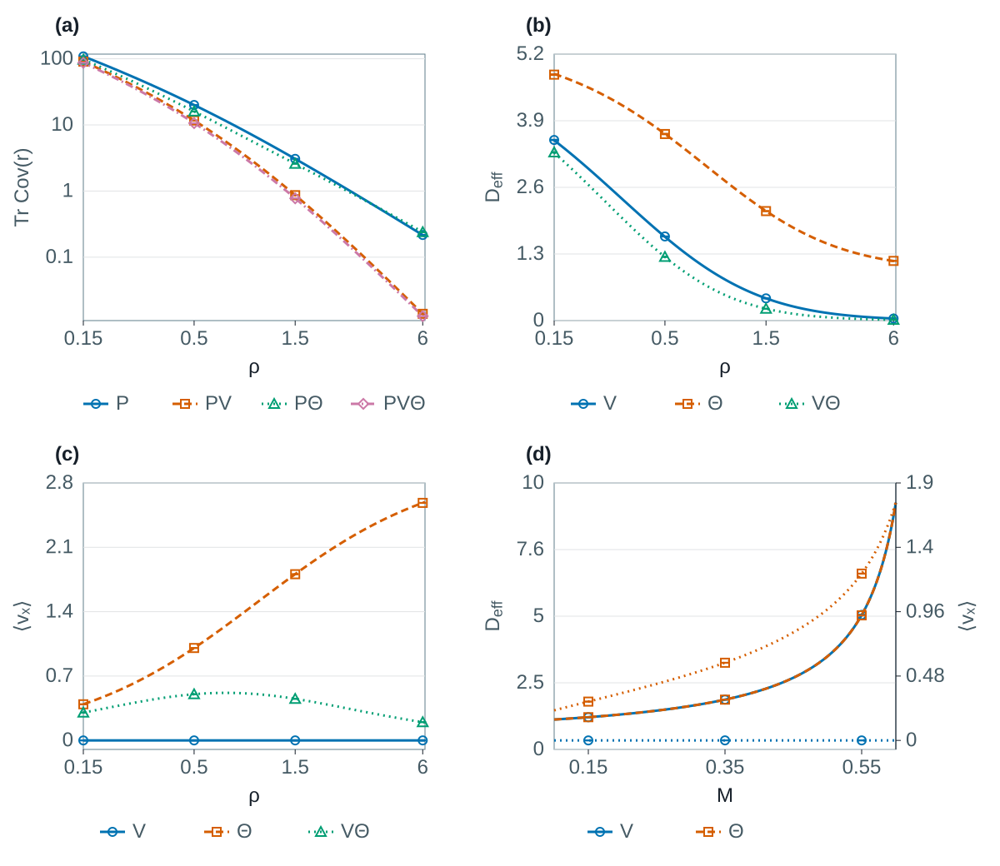

# Coordinate-selective resetting of inertial active Brownian motion: localization, sector invariance, and observable fingerprints

## Abstract

Coordinate-selective resetting produces distinct localization, kinetic, and transport responses in a two-dimensional inertial active Brownian particle. Position reset localizes centered spatial covariance without changing the internal velocity–orientation process. For velocity-retaining protocols, orientation reset polarizes propulsion and changes kinetic content across \(M\rho=1\); all four velocity-reset protocols share the complete-reset kinetic trace. A tuned velocity-only/orientation-only pair can share a diffusion tensor, but drift separates it. At known, matched model parameters, a categorical growth class, \(U_{xx}=E[\cos^2\theta]\), and \(\operatorname{Tr}S=E[|v|^2]\) exactly decode the seven protocols studied here. The moment results follow from a closed second-moment hierarchy, while internal-process invariance follows from the generator.

## Introduction

Stochastic resetting—interrupting a stochastic evolution at random times and returning part of the state to a prescribed target—generically produces nonequilibrium stationary states, finite-mean first-passage times, and rich renewal structure [1,2], and has been realized experimentally with holographic optical traps [3,4]. In parallel, active-matter physics studies particles that convert internal energy into persistent self-propulsion [5–7]; at finite mass the interplay of inertia, activity, and noise produces distinctive underdamped phenomenology [8]. The intersection of the two fields is now an active frontier.

A particle with position, velocity, and orientation admits many distinct resetting protocols, because the reset clock may act on any subset of the coordinates. The literature has explored this coordinate-selectivity one or a few protocols at a time: position and orientation resets of overdamped active particles [9–11], position–orientation resets in chiral and first-passage settings [12,13], position reset of underdamped passive particles with retained velocity [14], partial phase-space resets of the random-acceleration process [15,16], full-state resets of underdamped passive [17] and inertial active [20] particles, and velocity resetting in inertial transport [18,19]. Patel and Shee [20] identify position–velocity and velocity alone as possible protocols, anticipating distinct nonequilibrium steady-state statistics. Closest to the present setting, resetting a downstream coordinate is known to preserve upstream marginals in a passive anisotropic model [21]; related work considers sorting by velocity or orientation reset [22] and reset-optimized active-particle exploration [23]. Experimental implementations include optical-trap resetting [3,4]; which coordinates an apparatus returns is part of the intervention. (Coordinate-selective resetting is distinct from "partial resetting," in which a coordinate is rescaled by a random factor [24].) Collectively these works show that resetting different coordinates can produce different physics. The cited studies formulate prescribed reset protocols and analyze their consequences; the exact inverse all-seven-protocol question addressed here is a distinct scope.

Here we compare all seven fixed-zero reset protocols within one finite-inertia model. Position resetting can confine motion while preserving the full internal velocity–orientation process; orientation resetting can suppress or enhance kinetic content; and all four velocity-reset protocols share the same kinetic trace. A tuned velocity-only/orientation-only pair has equal diffusion but different drift. The resulting long-time fingerprints yield an exact matched-parameter identification result, complementary to inference from finite trajectories [25].

Restricting to long-time observables is a practically relevant observational regime, rather than an artificial handicap. A reset mechanism is frequently not something one can watch directly. The control channel may be inaccessible—an externally modulated trap, or an optical or chemical actuation applied to a population rather than to one tracked individual—or the measurement may simply be coarse: ensemble snapshots, density and velocity histograms, or scattering data, in which individual reset events are averaged away long before they can be counted. When the intervention itself cannot be observed, whatever can be learned about it must be read from the stationary statistics it leaves behind, which is precisely the regime treated here.

The question has a general form. A coordinate-selective stochastic intervention acts on a state space whose sectors are coupled in a definite direction—here orientation drives velocity and velocity drives position, with no feedback upstream. That triangular structure is what makes the inverse problem well posed: an intervention applied to one sector propagates downstream but leaves every sector above it untouched, so each coordinate deposits its bit in a distinct part of the long-time record. The result is a *code*—one bit per coordinate, read back by an exact inverse map, with an explicit account of which bits any coarser observation destroys. Whether a given system realizes such a code, and what its information-loss structure is, are questions one can ask of any hierarchically coupled dynamics under selective intervention. We show that inertial active Brownian motion realizes one exactly, and we obtain the code, the inverse map, and the full degeneracy structure in closed form. Treating all seven protocols within a single model is the means by which the structure becomes visible; the structure, not the enumeration, is the result.

The answer turns out to be sharp. First, resetting position is an exact localization switch: the centered spatial variance has a finite stationary limit precisely when position is among the reset coordinates, and the switch operates without disturbing the internal velocity–orientation dynamics at all, so that three pairs of protocols have identical internal processes yet opposite spatial fates. Second, the orientation bit and the velocity bit are stored in the stationary orientational moment and in the kinetic trace, respectively, so a three-observable signature exactly decodes all seven protocols at matched parameters. Third, observing less than the full signature merges protocols along exactly characterizable degeneracy structures—trace identities, a resonance condition, and a tuned diffusion coincidence—which we organize as equivalence classes induced by restricted observation. The Supplement verifies exhaustively that the larger second-order record separates every protocol pair, confirming that the three-observable decoder gives up nothing at the level of protocol identity.

The paper is organized as follows. Section 2 defines the model and the seven reset protocols. Section 3 summarizes the exact moment framework. Section 4 establishes the localization switch and the internal-sector invariance. Section 5 constructs the three-observable decoder. Section 6 characterizes the information lost under restricted observation. Section 7 presents representative exact parameter dependence, and Section 8 discusses scope and outlook.

## Model and reset protocols

In dimensionless variables the particle obeys

\[
d r=v\,dt,\qquad M\,dv=-\bigl(v-\mathrm{Pe}\,u(\theta)\bigr)dt+\sqrt2\,dW_t,
\qquad d\theta=\sqrt2\,dW_r,
\]

where \(u=(\cos\theta,\sin\theta)\) is the self-propulsion direction, \(M>0\) is the reduced mass, \(\mathrm{Pe}\ge0\) the Péclet number, and \(W_t\), \(W_r\) independent Wiener processes. The dimensional scaling is \(t=D_rt_d\), \(r=r_d/\sqrt{D/D_r}\), \(v=v_d/\sqrt{DD_r}\), \(M=mD_r/\gamma\), \(\mathrm{Pe}=v_a/\sqrt{DD_r}\), and \(\rho=\rho_0/D_r\), with \(D\) the translational and \(D_r\) the rotational diffusion coefficient.

Superimposed on this evolution, an independent Poisson clock of rate \(\rho>0\) triggers resets. At each event a fixed nonempty subset \(q\subseteq\{P,V,\Theta\}\) of coordinates is returned deterministically to the origin of its sector: position to \(r=0\), velocity to \(v=0\), orientation to \(\theta=0\). The seven protocols are \(P,V,\Theta,PV,P\Theta,V\Theta,PV\Theta\), and we take \(r(0)=v(0)=0\), \(\theta(0)=0\). A protocol is thus three binary choices—reset position or not, velocity or not, orientation or not—and the question is where each choice becomes visible.

## Exact moment framework

The backward generator of the reset dynamics closes on first and second moments: means and second moments of \((r,v,u)\) obey a finite linear hierarchy that can be solved exactly for every protocol (Supplement, Secs. S1–S3). From the solutions we extract the long-time record used throughout: stationary internal moments—the velocity matrix \(S=E[vv^{\mathsf T}]\), velocity–orientation correlations, and the orientation matrix \(U=E[uu^{\mathsf T}]\); stationary spatial moments for protocols that reset position; and asymptotic spatial coefficients (diffusion tensor \(D\), with \(D_{\mathrm{eff}}=\operatorname{Tr}D/2\), and mean drift) for protocols that do not.

One definitional point matters for everything that follows. Orientation resetting at \(\mathrm{Pe}>0\) polarizes the propulsion direction and produces a nonzero mean velocity, and, when position is not reset, a ballistic contribution to the raw mean-squared displacement. With position reset, the mean position instead approaches a stationary value. Centered covariance, rather than raw mean-squared displacement, defines spatial transport when orientation resetting produces drift; all spatial growth statements below refer to the centered quantity.

The hierarchy is not merely finite; it is *triangular*, and that structure carries the physics. Writing \(W=E[vu^\mathsf T]\), \(Q=E[ru^\mathsf T]\), \(C_{rv}=E[rv^\mathsf T]\), and \(R=E[rr^\mathsf T]\), the moment sectors form

\[
\underbrace{(u,U)}_{\text{orientation}}\ \longrightarrow\
\underbrace{(v,W,S)}_{\text{velocity}}\ \longrightarrow\
\underbrace{(r,Q,C_{rv},R)}_{\text{position}},
\]

each arrow denotes a one-way coupling: orientation forces velocity through the propulsion term \(\mathrm{Pe}\,u\), velocity forces position through \(\dot r=v\), and neither coupling runs backwards. The orientation block is autonomous, the velocity block depends on orientation but not on position, and position depends on both while feeding into nothing. Every structural result below is a consequence of this ordering. It is the reason a position reset cannot perturb the internal dynamics, and the reason orientation and velocity resets—applied upstream—reshape everything downstream of them.

Two of the three decoder observables follow from short closed balances, which we give here to exhibit the mechanism; the full hierarchy, the spatial coefficients, and the general-\(\mathrm{Pe}\) solutions are derived in the Supplement (Secs. S1–S3).

The orientation sector closes on itself. Orientation undergoes free rotational diffusion with generator \(\partial_\theta^2\), so the second harmonic \(m=E[\cos2\theta]\) obeys \(\dot m=-4m\) between reset events, while an orientation reset returns \(\theta\) to \(0\) and hence \(\cos2\theta\) to \(1\) at rate \(\rho\). Thus

\[
\dot m=-4m+\rho\,(1-m)\quad\Rightarrow\quad m_\infty=\frac{\rho}{\rho+4}
\]

when orientation is reset, and \(m_\infty=0\) when it is not. Since \(U_{xx}=E[\cos^2\theta]=(1+m)/2\), the two cases give \(U_{xx}=(\rho+2)/(\rho+4)\) and \(U_{xx}=1/2\) respectively—the orientation bit, separated by \(\rho/[2(\rho+4)]>0\). This holds at every \(\mathrm{Pe}\), because the orientation sector is autonomous.

## Coordinate-selective localization and sector invariance

The first fingerprint is spatial. Define the growth class \(G(q)\) of protocol \(q\) as *localized* if the centered spatial covariance \(\operatorname{Cov}(r(t))\) has a finite limit and *diffusive* if it grows linearly. Then, within the seven-protocol family, position reset is an exact localization switch:

\[
G(q)=\text{localized}\iff P\in q .
\]

If \(P\in q\), the resolvent structure of the reset generator yields a finite stationary centered covariance in closed form. If \(P\notin q\), then \(\operatorname{Cov}(r(t))=2Dt+O(1)\) with \(D\succ0\): the thermal contribution alone already bounds the diffusion tensor away from zero, whatever the reset protocol does to velocity and orientation. There is no intermediate case, no parameter window of anomalous growth, and no exception at special \((M,\rho,\mathrm{Pe})\).

The second fingerprint is what the switch does *not* do. Position is a downstream coordinate: it integrates velocity but feeds back on nothing. Resetting it therefore cannot influence the internal \((v,u)\) dynamics, and the three position-toggle pairs satisfy the exact process-level identities

\[
PV\equiv V,\qquad P\Theta\equiv\Theta,\qquad PV\Theta\equiv V\Theta
\]

on the full internal \((v,u)\) process, at every finite parameter point: all internal means, all internal second moments, and all higher internal statistics coincide (Supplement, Sec. S5.1). An analogous upstream-marginal preservation was observed for unidirectionally coupled passive coordinates [21]; here it holds exactly across the whole active, inertial protocol family. The physical picture is striking: a localized stationary cloud and an endlessly spreading one can run on *identical* internal engines—kinetic energy, orientational order, and velocity–orientation correlations agree observable by observable, while the spatial records diverge qualitatively. Localization from position reset is, in this precise sense, free of internal side effects.

Velocity and orientation resets, by contrast, act upstream and reshape the internal state itself: orientation reset polarizes \(u\) and (at \(\mathrm{Pe}>0\)) drives a mean drift, while velocity reset drains kinetic energy. These are the fingerprints the decoder reads next.

## Observable fingerprints and the exact protocol decoder

Collect three long-time observables into the signature

\[
\Sigma(q)=(G(q),U_{xx}(q),\operatorname{Tr}S(q)).
\]

**Theorem (three-observable decoder).** For every fixed \(M>0\), \(\rho>0\), and \(\mathrm{Pe}\ge0\), the map \(q\mapsto\Sigma(q)\) is injective on the seven nonempty reset protocols: the signature exactly decodes all seven protocols.

The proof is a three-branch argument (Supplement, Secs. S3–S4), and each branch reads one bit. The growth class \(G\) reads the position bit, by the localization switch above. The orientational moment \(U_{xx}\) reads the orientation bit, by the autonomous balance of Section 3: free rotational diffusion isotropizes the orientation to \(1/2\), while resetting to \(\theta=0\) sustains excess alignment at \((\rho+2)/(\rho+4)\), a gap of \(\rho/[2(\rho+4)]>0\) that persists at every \(\mathrm{Pe}\). Once these two bits are fixed, the only remaining ambiguity is the velocity bit within each class—\(P\) versus \(PV\), \(P\Theta\) versus \(PV\Theta\), \(\Theta\) versus \(V\Theta\). Here the kinetic trace is described by three expressions across the seven protocols; the first and third can coincide. Writing \(D_\star=M\rho+M+1\), each splits into a thermal and an activity contribution:

\[
\begin{aligned}
A&=\operatorname{Tr}S_P=\frac{2}{M}+\frac{\mathrm{Pe}^2}{M+1},\\[3pt]
B&=\operatorname{Tr}S_{PV}=\operatorname{Tr}S_{V}=\operatorname{Tr}S_{PV\Theta}=\operatorname{Tr}S_{V\Theta}
=\frac{4}{M(M\rho+2)}+\frac{2\mathrm{Pe}^2}{(M\rho+2)D_\star},\\[3pt]
C&=\operatorname{Tr}S_{P\Theta}=\operatorname{Tr}S_{\Theta}
=\frac{2}{M}+\frac{\mathrm{Pe}^2\bigl(M\rho^2+\rho+1\bigr)}{(\rho+1)D_\star}.
\end{aligned}
\]

The free value \(A\) is the \(d=2\) specialization of Eq. (14) of Patel and Chaudhuri [26]; the complete-reset value \(B\) is Eq. (5) of Patel and Shee [20], here extended to all four velocity-reset protocols. For the velocity-retaining protocols, with \(\Sigma_u=\operatorname{Cov}(u)\), the exact kinetic trace separates into velocity fluctuations and induced mean propulsion:

\[
\operatorname{Tr}S_{\Theta}=\frac{2}{M}+\frac{\mathrm{Pe}^2\operatorname{Tr}\Sigma_u}{1+M(1+\rho)}+|\bar v|^2,
\qquad
\operatorname{Tr}\Sigma_u=\frac{1+2\rho}{(1+\rho)^2},
\qquad
|\bar v|=\frac{\mathrm{Pe}\rho}{1+\rho}.
\]

Subtracting the free trace \(2/M+\mathrm{Pe}^2/(1+M)\) gives

\[
C-A=\frac{\mathrm{Pe}^2M\rho(M\rho-1)}{(1+M)(1+\rho)D_\star}.
\]

Orientation reset reduces orientational fluctuations and increases their relaxation rate from \(1\) to \(1+\rho\), reducing the activity-driven velocity fluctuations, but it also induces mean propulsion. For positive activity these effects balance at \(M\rho=1\): \(C<A\) below resonance and \(C>A\) above it. This competition concerns only velocity-retaining protocols; all four velocity-reset protocols share the complete-reset kinetic trace \(B\), independently of orientation reset.

The three velocity pairs are therefore separated by exactly two gaps, and each is a positive thermal term plus a nonnegative activity term:

\[
\begin{aligned}
A-B&=\frac{2\rho}{M\rho+2}
+\frac{M\rho\,\mathrm{Pe}^2\bigl(M\rho+M+3\bigr)}{(M+1)(M\rho+2)D_\star},\\[3pt]
C-B&=\frac{2\rho}{M\rho+2}
+\frac{M\rho\,\mathrm{Pe}^2\bigl(M\rho^2+3\rho+1\bigr)}{(\rho+1)(M\rho+2)D_\star}.
\end{aligned}
\]

Both gaps are thus at least the common thermal floor \(2\rho/(M\rho+2)>0\) at every point of the domain—the common passive-point gap—while the activity terms contribute a further strictly positive amount whenever \(\mathrm{Pe}>0\). Positivity is therefore immediate by inspection, with no cancellation to check. This completes the proof: \(G\) fixes the position bit, \(U_{xx}\) the orientation bit, and the two positive gaps resolve the velocity bit in every remaining case. Table 1 displays the branch values.

The decoder uses a categorical growth class and two scalar moments.

Table 1. Exact matched-parameter decoder signature; \(G\) is categorical.

| Protocol | \(G\) | \(U_{xx}\) | \(\operatorname{Tr}S\) |
|---|---|---|---|
| \(P\) | localized | \(1/2\) | \(A\) |
| \(V\) | diffusive | \(1/2\) | \(B\) |
| \(\Theta\) | diffusive | \((\rho+2)/(\rho+4)\) | \(C\) |
| \(PV\) | localized | \(1/2\) | \(B\) |
| \(P\Theta\) | localized | \((\rho+2)/(\rho+4)\) | \(C\) |
| \(V\Theta\) | diffusive | \((\rho+2)/(\rho+4)\) | \(B\) |
| \(PV\Theta\) | localized | \((\rho+2)/(\rho+4)\) | \(B\) |

Figure 1 gives representative transport and localization curves before we turn to the information discarded by restricted records.

Figure 1. Exact transport and localization. Panels (a)-(c) use \(M=2\) and \(\mathrm{Pe}=3\): stationary centered variance, centered effective diffusion, and mean drift. Panel (d) uses \(\rho=1/2\) along the stated \(\mathrm{Pe}(M)\) curve: the diffusion coefficient (left axis) coincides for \(V\) and \(\Theta\), while the dotted mean drift (right axis) separates them. Curves are exact; symbols are paired Richardson estimates from independent trajectories with one-SE bars (bars smaller than a symbol may be obscured). Rate axes in (a)-(c) and the variance axis in (a) are logarithmic. Full numerical results and precision details are given in Table S1.

## Information loss under restricted observation

At matched parameters, protocols are \(\mathcal O\)-equivalent when all observables in \(\mathcal O\) agree. Table 2 gives the exact classes for proper sub-signatures; Supplement Sec. S5 covers the second-order record. Three mechanisms explain the lost information.

Table 2. Numbers of distinguishable classes. \(T=\operatorname{Tr}S\); the exceptional set is \(\mathrm{Pe}=0\) or \(M\rho=1\).

| Retained record | Generic | Exceptional |
|---|---|---|
| \(G\) | 2 | 2 |
| \(U_{xx}\) | 2 | 2 |
| \(T\) | 3 | 2 |
| \((G,U_{xx})\) | 4 | 4 |
| \((G,T)\) | 5 | 4 |
| \((U_{xx},T)\) | 4 | 4 |
| \(\Sigma=(G,U_{xx},T)\) | 7 | 7 |

*Internal observations hide position reset.* By sector invariance, the entire internal record—every function of \((v,u)\)—is blind to the position bit: under internal observation the seven protocols collapse to the four classes \(\{P\},\{V,PV\},\{\Theta,P\Theta\},\{V\Theta,PV\Theta\}\). An experiment that tracks speed and orientation but not displacement cannot tell a localized system from a transporting one.

*Scalar traces hide orientation structure.* Contracting matrices to traces discards the anisotropy that stores the orientation bit. For \(PV/PV\Theta\) the scalar triple \((\operatorname{Tr}S,\operatorname{Tr}C_{rv},\operatorname{Tr}R)\) agrees exactly—a consequence of \(\operatorname{Tr}U=1\)—although for finite activity the centered spatial variances differ by the explicit gap \(\mathrm{Pe}^2/[(1+\rho)^2(1+M\rho)^2]\), which is strictly positive for \(\mathrm{Pe}>0\) and vanishes at the passive point. Likewise \(\operatorname{Tr}S_V=\operatorname{Tr}S_{V\Theta}\) at every finite parameter point, while orientational moments and drift separate the pair. Thus scalar traces can hide orientation information that remains visible in orientational moments.

*Parameter-specific observational coincidences.* The trace triple for \(P/P\Theta\) differs by terms proportional to \(\mathrm{Pe}^2(M\rho-1)\), so it coincides on the resonance \(M\rho=1\)—where the reset rate matches the velocity relaxation rate—and at the passive point \(\mathrm{Pe}=0\). The two coincidences are resolved differently. On the resonance, activity is still present and both the orientational mean \(\bar u_x\) and the positional mean \(\bar r_x=\mathrm{Pe}/(1+\rho)\) separate the pair. At \(\mathrm{Pe}=0\) the entire translational sector of \(P\) and \(P\Theta\) coincides—in particular \(\bar r_x=0\) for both—and only orientational observables such as \(\bar u_x=\rho/(1+\rho)\) remain as witnesses. The same passive coincidence pairs \(PV/PV\Theta\) and \(V/V\Theta\), since without propulsion the orientation no longer couples to motion; orientational observables keep every such pair distinct for all \(\rho>0\). At this passive endpoint, \(D_\Theta=I\) for every \(\rho>0\). For \(\mathrm{Pe}>0\) and \(\rho>0\), the anisotropy is \(D_{\Theta,xx}-D_{\Theta,yy}=-\mathrm{Pe}^2\rho(2\rho-1)/[(1+\rho)^3(4+\rho)]\). These orientation-only coefficients recover the overdamped orientation-reset result of Kumar, Sadekar and Basu [9], Eq. (46); with velocity retained, translational inertia leaves their long-time values unchanged. Here they enter the exact comparison with velocity-reset transport. Thus \(D_\Theta\) is isotropic only at \(\rho=1/2\).

The sign change is a centered effect: \(\Sigma_{u,xx}-\Sigma_{u,yy}=\rho/(\rho+4)-\rho^2/(1+\rho)^2=\rho(1-2\rho)/[(\rho+4)(1+\rho)^2]\), and \(D_\Theta\) carries this difference times \(\mathrm{Pe}^2/(1+\rho)\). Thus at \(\rho=1/2\) centered spreading is isotropic despite nonzero polarization; isotropic covariance does not imply an isotropic orientation distribution.

Since \(D_V\) is isotropic, \(D_\Theta=D_V\) can occur only there; on that line tensor equality reduces to one scalar equation for \(\mathrm{Pe}^2(M)\),

\[
\rho=\tfrac12,\qquad \mathrm{Pe}^2=\frac{27M(M+6)(3M+2)}{2\,(44-9M-80M^2-12M^3)},\qquad 0<M<M_\star\approx0.658,
\]

on which velocity-only and orientation-only resetting share the same centered effective diffusion tensor: two entirely different microscopic interventions—draining kinetic energy versus re-aligning propulsion—produce identical spatial spreading. The coincidence is broken by the mean drift, which vanishes for \(V\) and is nonzero for \(\Theta\) at \(\mathrm{Pe}>0\).

The general lesson is that reset information is stored non-redundantly in specific sectors of the long-time record: discard a sector, and the corresponding bit becomes invisible in an exactly characterizable way. Since \(\Sigma\) is itself part of the second-order record, its injectivity already implies that the complete record separates every pair; the Supplement's pair-by-pair witness catalogue (Sec. S4) is therefore an exhaustive verification rather than a further theorem, and its value is that it names an explicit separating observable for each of the 21 pairs.

## Representative parameter dependence

Figure 1 shows the exact formulas at work across the reset rate. For the four localized protocols (panel a; \(M=2\), \(\mathrm{Pe}=3\)), the stationary centered variance decreases with reset rate at the plotted parameters, and the four curves remain distinct at every rate shown. The frequent-reset regime reveals a further coordinate-selective effect: without velocity reset the particle restarts each interval carrying its accumulated velocity, and the general asymptotic law is \(\rho^2E_P|r|^2\to4/M+2\mathrm{Pe}^2/(1+M)\), whereas resetting velocity along with position makes the particle restart from rest and gains a full extra power, \(\rho^3E_{PV}|r|^2\to8/M^2\) (Supplement, Sec. S6.5).

For the three diffusive protocols, the effective diffusion (panel b) and the mean drift (panel c) tell complementary stories. Velocity resetting suppresses transport strongly—\(D_{\mathrm{eff},V}\sim(\mathrm{Pe}^2+4)/(2M^2\rho^2)\to0\) at large \(\rho\), since the particle repeatedly restarts from rest—while orientation resetting leaves a thermal floor, \(D_{\mathrm{eff},\Theta}\to1\), and instead converts activity into polarization: the mean drift of \(\Theta\) grows toward full alignment, \(\bar v_\Theta\to\mathrm{Pe}\,e_x\), whereas \(V\) has zero drift at every rate and the combined \(V\Theta\) drift decays as \(\mathrm{Pe}/(M\rho)\). Orientation reset is thus a drift generator and velocity reset a transport brake; applied together, the brake wins at high rate.

Panel d displays the tuned \(V/\Theta\) coincidence of Sec. 6 along its exact curve, together with its breaker: the two diffusion coefficients coincide identically in \(M\) along the curve while the \(\Theta\) drift stays finite and the \(V\) drift is identically zero. Degeneracy in one observable, resolution in the next—the coarse-graining structure of Sec. 6 in miniature.

The singular limits bound the picture (Supplement, Sec. S6). As \(M\to0^+\) velocity ceases to be an independent state variable and the velocity bit degenerates in the position outputs; the limit does not commute with the classification, which is one reason the theorem is stated at fixed \(M>0\). As \(\rho\to0^+\) the formulas recover the appropriate rare-reset limits, as verified by the corresponding limiting laws; the stationary spatial sector of the position-reset protocols is the exception, becoming singular as \(\rho\to0^+\) because the stationary variance diverges there while setting \(\rho=0\) outright gives an unbounded free diffuser. Those two limits do not commute.

After inspection of the finest-step results, Richardson extrapolation was adopted using the existing coupled paths without new sampling (Supplement, Sec. S0.2). The raw-finest analysis already contained 80/80 intervals, with 0 contradicted and 78/80 meeting the stricter target; its \(\operatorname{Tr}S\) residuals reached about \(+8.1\) SE. Kinetic-trace convergence ratios were 1.999--2.006, and Richardson did not rescue containment. Table S1 reports the paired combinations \(2X_h-X_{2h}\), which cancel the leading \(O(h)\) bias; scale-normalized SEs are below 1%, and raw finest-step values are archived.

## Discussion and conclusion

Position resetting can localize a particle while leaving its complete internal dynamics unchanged. For velocity-retaining protocols, orientation resetting changes alignment and kinetic content, with suppression below \(M\rho=1\) and enhancement above it at positive activity; velocity resetting suppresses transport and gives the same kinetic trace across four protocols. The tuned \(V/\Theta\) coincidence shows why matching diffusion alone does not identify the intervention: equal spreading can coexist with different drift. The three-observable decoder is a compact consequence of these sector distinctions, while its proper sub-signatures quantify exactly which distinctions a restricted measurement loses.

The moment statements follow exactly from the deterministic hierarchy, and internal-sector invariance follows from the reset generator. The theorem is restricted to fixed zero targets, matched \(M>0\), \(\rho>0\), and \(\mathrm{Pe}\ge0\), rather than finite-data inference, singular limits, or changed targets. The theorem does not exclude a different two-observable family. The independent grid calculation reproduces selected moment formulas at prespecified points; it does not establish the full theorem set.

## Data and code availability

The R6B manuscript sources, reproducibility code (software version 3.2.0rc2), and numerical records are available at [Zenodo, DOI 10.5281/zenodo.22924890](https://doi.org/10.5281/zenodo.22924890).

## References

1. M. R. Evans and S. N. Majumdar, *Diffusion with stochastic resetting*, Phys. Rev. Lett. **106**, 160601 (2011). https://doi.org/10.1103/PhysRevLett.106.160601
2. M. R. Evans, S. N. Majumdar, and G. Schehr, *Stochastic resetting and applications*, J. Phys. A: Math. Theor. **53**, 193001 (2020). https://doi.org/10.1088/1751-8121/ab7cfe
3. O. Tal-Friedman, A. Pal, A. Sekhon, S. Reuveni, and Y. Roichman, *Experimental realization of diffusion with stochastic resetting*, J. Phys. Chem. Lett. **11**, 7350 (2020). https://doi.org/10.1021/acs.jpclett.0c02122
4. B. Besga, A. Bovon, A. Petrosyan, S. N. Majumdar, and S. Ciliberto, *Optimal mean first-passage time for a Brownian searcher subjected to resetting: Experimental and theoretical results*, Phys. Rev. Res. **2**, 032029 (2020). https://doi.org/10.1103/PhysRevResearch.2.032029
5. P. Romanczuk, M. Bär, W. Ebeling, B. Lindner, and L. Schimansky-Geier, *Active Brownian particles: From individual to collective stochastic dynamics*, Eur. Phys. J. Spec. Top. **202**, 1 (2012). https://doi.org/10.1140/epjst/e2012-01529-y
6. M. C. Marchetti, J. F. Joanny, S. Ramaswamy, T. B. Liverpool, J. Prost, M. Rao, and R. A. Simha, *Hydrodynamics of soft active matter*, Rev. Mod. Phys. **85**, 1143 (2013). https://doi.org/10.1103/RevModPhys.85.1143
7. C. Bechinger, R. Di Leonardo, H. Löwen, C. Reichhardt, G. Volpe, and G. Volpe, *Active particles in complex and crowded environments*, Rev. Mod. Phys. **88**, 045006 (2016). https://doi.org/10.1103/RevModPhys.88.045006
8. H. Löwen, *Inertial effects of self-propelled particles: From active Brownian to active Langevin motion*, J. Chem. Phys. **152**, 040901 (2020). https://doi.org/10.1063/1.5134455
9. V. Kumar, O. Sadekar, and U. Basu, *Active Brownian motion in two dimensions under stochastic resetting*, Phys. Rev. E **102**, 052129 (2020). https://doi.org/10.1103/PhysRevE.102.052129
10. A. Ghosh, S. Mandal, and S. Chaki, *Anisotropic active Brownian particle in two dimensions under stochastic resetting*, Phys. Rev. E **113**, 014142 (2026). https://doi.org/10.1103/11f6-srsx
11. Y. Baouche, T. Franosch, M. Meiners, and C. Kurzthaler, *Active Brownian particle under stochastic orientational resetting*, New J. Phys. **26**, 073041 (2024). https://doi.org/10.1088/1367-2630/ad602a
12. A. Shee, *Steering chiral active Brownian motion via stochastic position-orientation resetting*, Phys. Rev. E **113**, 025424 (2026). https://doi.org/10.1103/xvkg-qcjq
13. Y. Baouche and C. Kurzthaler, *Optimal first-passage times of active Brownian particles under stochastic resetting*, Soft Matter **21**, 5998 (2025). https://doi.org/10.1039/D5SM00340G
14. D. Gupta, *Stochastic resetting in underdamped Brownian motion*, J. Stat. Mech.: Theory Exp. **2019**, 033212 (2019). https://doi.org/10.1088/1742-5468/ab054a
15. P. Singh, *Random acceleration process under stochastic resetting*, J. Phys. A: Math. Theor. **53**, 405005 (2020). https://doi.org/10.1088/1751-8121/abaf2d
16. K. Capała and B. Dybiec, *Random acceleration process on finite intervals under stochastic restarting*, J. Stat. Mech.: Theory Exp. **2021**, 083216 (2021). https://doi.org/10.1088/1742-5468/ac1664
17. H. Franke and I. M. Sokolov, *Resetting of underdamped Brownian motion*, Phys. Rev. E **113**, 064125 (2026). https://doi.org/10.1103/qyl8-6q9h
18. K. S. Olsen and H. Löwen, *Dynamics of inertial particles under velocity resetting*, J. Stat. Mech.: Theory Exp. **2024**, 033210 (2024). https://doi.org/10.1088/1742-5468/ad319a
19. S. Howlader, S. Mondal, and P. Das, *Velocity resetting of inertial run-and-tumble particles in non-Newtonian media*, Phys. Fluids **38**, 067118 (2026). https://doi.org/10.1063/5.0333412
20. M. Patel and A. Shee, *Controlling inertial active Brownian motion via stochastic resetting*, arXiv:2602.21134 (2026).
21. S. Chaki, K. Stølevik Olsen, and H. Löwen, *Dynamics of a single anisotropic particle under various resetting protocols*, J. Phys.: Condens. Matter **37**, 115101 (2025). https://doi.org/10.1088/1361-648X/ada336
22. B. Cleuren and R. Eichhorn, *Sorting by resetting*, arXiv:2603.19430 (2026).
23. K. S. Olsen, H. Löwen, and L. Caprini, *Optimal area exploration by resetting active particles*, Phys. Rev. Lett. **137**, 057102 (2026). https://doi.org/10.1103/sytg-m4ms
24. O. Tal-Friedman, Y. Roichman, and S. Reuveni, *Diffusion with partial resetting*, Phys. Rev. E **106**, 054116 (2022). https://doi.org/10.1103/PhysRevE.106.054116
25. A. Frishman and P. Ronceray, *Learning force fields from stochastic trajectories*, Phys. Rev. X **10**, 021009 (2020). https://doi.org/10.1103/PhysRevX.10.021009
26. M. Patel and D. Chaudhuri, *Exact moments and re-entrant transitions in the inertial dynamics of active Brownian particles*, New J. Phys. **25**, 123048 (2023). https://doi.org/10.1088/1367-2630/ad1538; arXiv:2310.00802.
